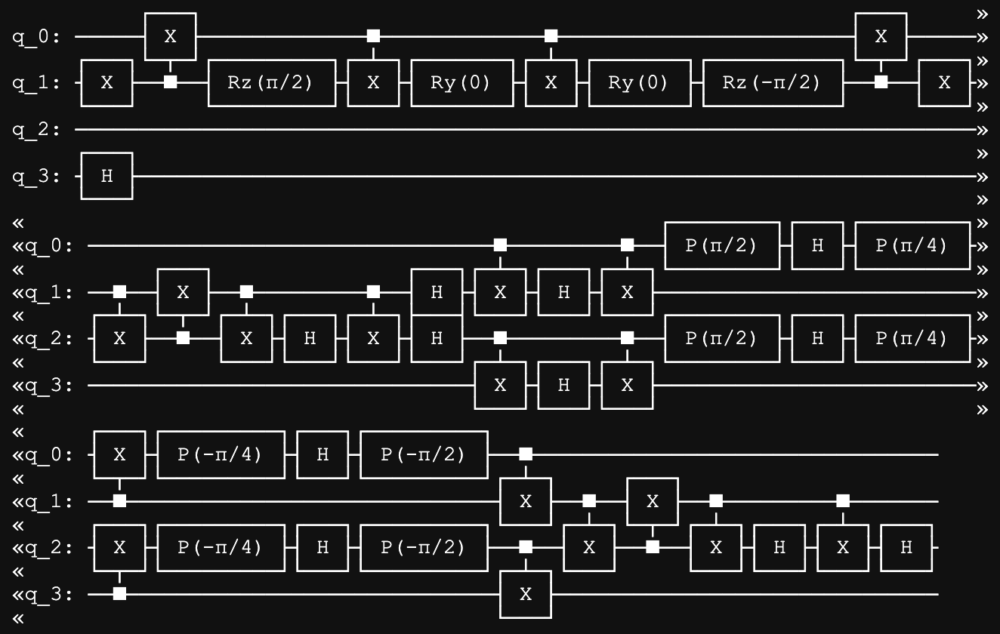

# Quantum Nexus | IonQ Challenge Documentation

Mason Abrell, Shreya Chaudhary, Derek Kaplan, Imam Mian, and Zachary Zitzewitz

### Technical Brainstorming
Our journey started as soon as the IonQ challenge was announced, our entire team rushing off to a nearby classroom while mentally flying through different possible things we could “create” using quantum hardware. We began our process by combing through the linked IonQ  inspiration articles as a team, dividing up the various applications and researching them. Several ideas caught our attention, including music generation and the quantum ray tracing, and we discovered interesting procedures that had gone unmentioned such as quantum genetic algorithms.  However there was one idea that caught not only our attention, but our imagination as well: quantum procedural generation. Procedural generation is the creation of  new data by a computer, and it can be used to generate entirely new virtual worlds, just as the linked paper showed. With this, we were inspired to create a new world with the quantum hardware at our fingertips, but the question was, what do we create?

Figure 1: Our list of technical ideas

### Creative Brainstorming
So, it was straight to the chalkboard, where we ended up just looking at that blank state for about 15 minutes. In a idea drought, we decided to call back to what Matthew Keesan said when he announced the challenge: “If you think its cool, we’ll think its fucking awesome.” So, we decided to list things on the board that we considered awesome! This list grew to include everything from The Godfather to Bears (wearing sunglasses), and although chaotic, it helped us refine our desire to pursue an idea we had mentioned in the previous list: generating a D&D dungeon. We realized that we could potentially combine the truly random noise mapping in quantum with an algorithm that “condenses” points in order to create a pseudo cave system, reminiscent of many a D&D dungeon. Finally, we had the idea to use another procedural generation process to generate textures for the dungeon to increase the authenticity. So, we used quantum blurring to randomly alter a seed image of “cobblestone” in order to vary the texture that we would map onto the generated dungeon. 

However, we still had a plethora of ideas left in the “cool things” list to work with so…..we created a little bit of backstory.

It was a dark stormy night in the mid 1920s, at the height of Al Capone’s power, there emerged a new rival….a grizzly bear! But this was no ordinary bear, oh no, this was a sunglasses-toting, recently escaped from prison, and dead set on building his own criminal syndicate kinda bear…this was Al Ursus. Al Ursus slowly grew his bear mafia, recruiting both from the streets and zoos of Chicago. But his hunger for power could not be satiated (oh btw Al Ursus is immortal) and as the years drew on he could not settle for just dominion over the Chicago Underworld, he wanted to control the entire Underworld! However, he mostly wanted to control the entire Underworld because he loved D&D and wanted to share it with the entire world. Years passed and Al Ursus emerged into the 2020s, determined to finally achieve his goal. However he realized that he needed two things to succeed: an in-depth understanding of the working of paramagnets to improve his bear railguns and the ability to more rapidly produce D&D materials for those who wanted it. So, he turned to us…

### Step 1: Noise Map Process
The goal of the noise map process is to generate a random, noisy image that approximates the shape of a dungeon, which can then be denoised in the next step to create our final map. To achieve this, we use a modified version of the quantum blur algorithm that is also used in step 3. We first establish a mapping of bitstrings to positions in which adjacent positions have bitstrings that only differ in one place. We then randomly select 10 positions in the image and set their initial amplitude to a random value, while the rest of the image remains black. Next, we perform a y-rotation of 6 followed by an x-rotation of 6 . This causes some of the amplitude of the seeds to shift to neighboring positions, resulting in clusters that approximate rooms, as well as lines that approximate hallways. Next, we take a limited number of measurements to determine the value of each position in the image, as we only need a binary value for each position, rather than an exact amplitude. If even a single measurement produces a certain position, we assign that position a 1; we then assign a 0 to positions that were never measured. By taking a limited number of measurements, we reduce the likelihood of measuring low-amplitude positions and increase the speed of the process. However, because the resultant map was produced using random noise, it is very noisy. Thus, we apply the Ising model to the noisy image in the next step to reduce the noise present in the image.

### Step 2: Ising Model
The goal of this step is to take a noisy two-dimensional binary grid of pixels and output a random but plausible map of a dungeon or cave. To achieve this, we were inspired by the Ising model, an approach to simulating the statistical and quantum mechanical process of magnetic dipole alignment in ferromagnetic materials. The Ising model takes in a square and topologically toroidal lattice of discrete values for spin—1 and -1—and evolves these spins based on possible changes in the total energy of the system. Qualitatively, this results in spin flips in atoms that are adjacent to many others of the opposite spin and ends up with homogenous same-spin blobs, whose boundary’s curvature decreases with time.

More specifically, we define the Hamiltonian as proportional to the number of interactions between atoms with opposite spin states which are adjacent in the lattice. The Hamiltonian also (sometimes) includes a term for the effect of an additional externally applied magnetic field on spin. It can be shown that the classical anisotropic Ising model for two-dimensional lattices is dual to the quantum transverse field Ising model in one dimension. Because of this duality, as well as the fact that computationally expensive Monte Carlo methods are most commonly used for numerical simulations, quantum computing appears to be an appealing alternative. Towards that end, our group produced a 4-qubit quantum circuit out of elementary CNOT, X, Hadamard, phase, and rotation gates that diagonalizes the Ising Hamiltonian and can compute the ground state transverse magnetization, as outlined by Cervera-Lierta. The circuit can be broken up into a Jordan-Wigner transform, quantum Fourier transform, and inverse Bogoliubov gates.

However, due to time constraints and a limited understanding of the material, we were unable to properly ascertain and take advantage of the duality between quantum and classical Ising models. Thus, we did not simulate ferromagnetism on a quantum computer. Instead, we resorted to the classical Metropolis-Hastings algorithm to produce our results. In this algorithm, an atom is selected at random and the probability of it flipping is proportional to the exponential of the difference in energy in the cases where the atom does and does not flip. We implemented this on a 128x128 grid, taking as an input the quantumly generated noise from the previous field and returning a far smoother bitmap which could plausibly represent a dungeon or cave system. This data was then passed to quantum blurring. To visually demonstrate the algorithm, we made a nice gif.

### Step 3: Quantum Blur
The goal of the quantum blur algorithm is to synthetically create the background texture for the map using quantum procedural generation. To generate a texture, the algorithm took as input an image of a stone. Three maps of the stone were created for its rgb values. In each map, there was an index of the coordinates of each pixel and its corresponding red, green, and blue values. Each coordinate is mapped to a bitstring where each adjacent pixel coordinates have adjacent 1s in the bitstring. Each qubit represents a different bit string from this list (so, at a minimum, there is log2(img width*img height) qubits. For each red, green, and blue value, there is a different circuit. In each circuit, every qubit is initialized to its normalized red, green, or blue value. Next, to add the blur, each qubit next has x-rotation. When this circuit goes through the shots, the probability is converted to the frequency of each value which can then be normalized and converted to rgb values and therefore pixels. This will result in a new, blurred image based on the previous image.

Sample Generated Textures with Gradients

Examples of randomly generated boards

Final Map with Textures

### Why we did this? What is the impact?
One of the most appealing parts of games like Minecraft is the fact that the player is offered the opportunity to experience a vast, new world. The intense anticipation after hitting the start button, waiting to see what mountains and caves, what tundras and deserts there are to explore, is perhaps one of the most universal experiences in gaming. Our initial motivation for this project took inspiration from the procedural generation present in many such games, with our eyes set on taking advantage of quantum computing to produce randomly generated content, specifically a dungeon map à la D&D. And the successful results not only stand as a testament to this desire, but also, as IBM’s Dr. James Wootton puts it, “as a starting point for others to start experimenting with what quantum could do for them”. But make no mistake, the impact of our work doesn’t end there. In fact, we didn’t have to wait long at all to see the truth of Dr. Wootton’s words. The team’s investigation into the utility of Ising models for our purposes led to the creation of a visual simulation of the alignment of a paramagnet, an incredibly effective educational tool. 

And before you think we’ve forgotten about our good friend Al Ursus the mafia bear, any analysis of the significance of our work would be incomplete without mention of its aid to his criminal affairs. Taking an economic lens, we see that our work is able to shift the supply in both the market for D&D and world domination. In the former case, the map generators increase ease of production. In the latter case, Al Ursus’ newfound knowledge on the workings of paramagnets have allowed him to take advantage of railguns, a technological advancement. So, in both cases, the respective prices decrease and Al Ursus is now able to finally acquire their deepest desires.

